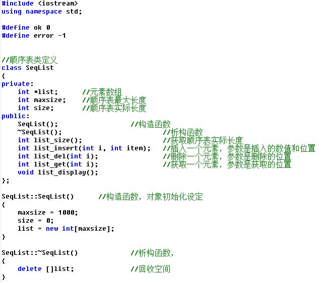

### 题目描述
实现顺序表的用C++语言和类实现顺序表

属性包括：数组、实际长度、最大长度（设定为1000）

操作包括：创建、插入、删除、查找

类定义参考



### 输入
第1行先输入n表示有n个数据，即n是实际长度；接着输入n个数据

第2行输入要插入的位置和新数据

第3行输入要插入的位置和新数据

第4行输入要删除的位置

第5行输入要删除的位置

第6行输入要查找的位置

第7行输入要查找的位置

### 输出
数据之间用空格隔开

第1行输出创建后的顺序表内容，包括顺序表实际长度和数据

每成功执行一次操作（插入或删除），输出执行后的顺序表内容

每成功执行一次查找，输出查找到的数据

如果执行操作失败（包括插入、删除、查找等失败），输出字符串error，不必输出顺序表内容

### 输入样例1
```cpp
6 11 22 33 44 55 66
3 777
1 888
1
9
0
5
```

### 输出样例1
```cpp
6 11 22 33 44 55 66 
7 11 22 777 33 44 55 66 
8 888 11 22 777 33 44 55 66 
7 11 22 777 33 44 55 66 
error
error
44
```
### 源代码
```cpp
#include <iostream>

using namespace std;
#define ok 1
#define error -1

class SeqList {
    int *list, maxsize, size;
public:
    //构造函数
    SeqList();

    //含参数的构造函数
    SeqList(int *arr, int n);

    //析构函数，delete功能实现
    ~SeqList();

    //顺序表长度（由于size是私有）
    int list_size();

    //顺序表的插入，i为物理位置（从1开始），item为元素
    int list_insert(int i, int item);

    //顺序表的元素删除
    int list_del(int i);

    //顺序表的元素获取
    int list_get(int i);

    //顺序表的元素打印
    void list_display();
};

SeqList::SeqList() {
    //设定最大长度
    maxsize = 1000;
    size = 0;
    list = new int[maxsize];
}

SeqList::SeqList(int *arr, int n) {
    //接受一个连续的数组，并赋值给顺序表类中的list数组
    maxsize = 1000;
    size = n;
    list = new int[n];
    list = arr;
}

SeqList::~SeqList() {
    //delete释放内存
    delete[]list;
}

int SeqList::list_size() {
    //返回顺序表大小
    return size;
}

int SeqList::list_insert(int i, int item) {
    /*
     *可以把物理位置转换为逻辑位置，也就是t=i-1，list数组的最大下标为list[size-1]，之后判断以下：
     * 当t>size时，可以认为t的位置超过了数组本来的长度；当t<0，认为t的数组下标为负值，没有意义
     * 从最后一项开始，每次移动一个位置
     */
    if (i > size + 1 || i < 1) {
        cout << "error" << endl;
        return error;
    }
    for (int j = size - 1; j >= i - 1; j--) {
        list[j + 1] = list[j];
    }
    list[i - 1] = item;
    size++;
    return ok;
}

int SeqList::list_del(int i) {
    if (i > size || i < 1) {
        cout << "error" << endl;
        return error;
    }
    for (int j = i - 1; j < size - 1; j++) {
        list[j] = list[j + 1];
    }
    size--;
    return ok;
}

int SeqList::list_get(int i) {
    if (i > size || i < 1) {
        cout << "error" << endl;
        return error;
    }
    cout << list[i - 1] << endl;
    return ok;
}

void SeqList::list_display() {
    cout << size << ' ';
    for (int i = 0; i < size; i++)
        cout << list[i] << ' ';
    cout << endl;
}

int main() {
    int n, item;
    cin >> n;
    SeqList sqlist;
    for (int i = 0; i < n; i++) {
        int element;
        cin >> element;
        sqlist.list_insert(i + 1, element);
    }
    sqlist.list_display();

    cin >> n >> item;
    if (sqlist.list_insert(n, item) == ok)
        sqlist.list_display();
    cin >> n >> item;
    if (sqlist.list_insert(n, item) == ok)
        sqlist.list_display();

    cin >> n;
    if (sqlist.list_del(n) == ok)
        sqlist.list_display();
    cin >> n;
    if (sqlist.list_del(n) == ok)
        sqlist.list_display();

    cin >> n;
    sqlist.list_get(n);
    cin >> n;
    sqlist.list_get(n);

    return 0;
}
```

