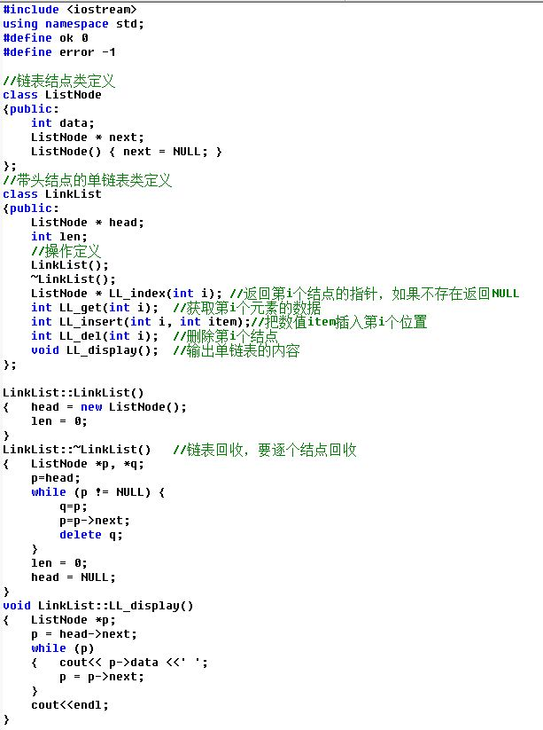

### 题目描述
用C++语言和类实现单链表，含头结点

属性包括：data数据域、next指针域

操作包括：插入、删除、查找

注意：单链表不是数组，所以位置从1开始对应首结点，头结点不放数据

类定义参考

### 输入
n

第1行先输入n表示有n个数据，接着输入n个数据

第2行输入要插入的位置和新数据

第3行输入要插入的位置和新数据

第4行输入要删除的位置

第5行输入要删除的位置

第6行输入要查找的位置

第7行输入要查找的位置
### 输出
n

数据之间用空格隔开，

第1行输出创建后的单链表的数据

每成功执行一次操作（插入或删除），输出执行后的单链表数据

每成功执行一次查找，输出查找到的数据

如果执行操作失败（包括插入、删除、查找等失败），输出字符串error，不必输出单链表
### 输入样例1
```cpp
6 11 22 33 44 55 66
3 777
1 888
1
11
0
5
```

### 输出样例1
```cpp
11 22 33 44 55 66 
11 22 777 33 44 55 66 
888 11 22 777 33 44 55 66 
11 22 777 33 44 55 66 
error
error
44
```
### 源代码
```cpp
#include "bits/stdc++.h"

using namespace std;
#define ok 0
#define error -1

class ListNode {
public:
    int data;
    ListNode *next;

    ListNode() {
        next = nullptr;
    }
};

class LinkList {
public:
    ListNode *head;
    int len;

    LinkList();

    ~LinkList();

    ListNode *LL_index(int i); //返回第i个节点的指针，不存在则返回NULL
    int LL_get(int i);              //获取第i个节点
    int LL_insert(int i, int item); //在第i的位置插入新节点
    int LL_del(int i);              //删除第i个节点
    void LL_display();              //输出
};

LinkList::LinkList() {
    head = new ListNode;
    len = 0;
}

LinkList::~LinkList() {
    ListNode *p, *q;
    p = head;
    while (p != nullptr) {
        q = p;
        p = p->next;
        delete q;
    }
    len = 0;
    head = nullptr;
}

//返回第i个节点的指针，不存在则返回NULL
ListNode *LinkList::LL_index(int i) {
    int real_pos = i - 1, cnt = -1;
    if (real_pos >= len || real_pos < 0)
        return nullptr;
    ListNode *p = head;
    while (p != nullptr) {
        if (cnt++ != real_pos) {
            p = p->next;
        } else {
            return p;
        }
    }
    return nullptr;
}

int LinkList::LL_get(int i) {
    int cnt = 0, real_pos = i - 1;
    ListNode *p = head;
    if (real_pos >= len || real_pos < 0)
        return error;
    while (p != nullptr) {
        p = p->next;
        if (cnt++ == real_pos)
            return p->data;
    }
    return error;
}

int LinkList::LL_insert(int i, int item) {
    int real_pos = i - 1, cnt = 0;
    ListNode *p;
    p = head;
    if (real_pos > len || real_pos < 0)
        return error;
    while (p != nullptr) {
        if (cnt++ != real_pos) {
            p = p->next;
        } else {
            ListNode *q = new ListNode();
            q->next = p->next;
            p->next = q;
            q->data = item;
            len++;
            return ok;
        }
    }
    return error;
}

int LinkList::LL_del(int i) {
    int real_pos = i - 1, cnt = 0;
    if (real_pos > len || real_pos < 0)
        return error;
    ListNode *p = head;
    while (p != nullptr) {
        if (cnt++ != real_pos) {
            p = p->next;
        } else {
            ListNode *q = p->next, *r = p->next->next;
            delete q;
            p->next = r;
            len--;
            return ok;
        }
    }
    return error;
}

void LinkList::LL_display() {
    ListNode *p;
    p = head->next;
    while (p != nullptr) {
        //if (p != head) cout << ' ';
        cout << p->data << ' ';
        p = p->next;
    }
    cout << endl;
}

int main() {
    int n;
    LinkList ll;
    cin >> n;
    //ll.LL_create(n);
    for (int i = 1; i <= n; i++) {
        int value;
        cin >> value;
        ll.LL_insert(i, value);
    }
    ll.LL_display();

    int val;
    cin >> n >> val;
    if (ll.LL_insert(n, val) == ok)
        ll.LL_display();
    else
        cout << "error" << endl;
    cin >> n >> val;
    if (ll.LL_insert(n, val) == ok)
        ll.LL_display();
    else
        cout << "error" << endl;

    cin >> n;
    if (ll.LL_del(n) == ok)
        ll.LL_display();
    else
        cout << "error" << endl;
    cin >> n;
    if (ll.LL_del(n) == ok)
        ll.LL_display();
    else
        cout << "error" << endl;

    cin >> n;
    ListNode *p = ll.LL_index(n);
    if (p != nullptr)
        cout << p->data << endl;
    else
        cout << "error" << endl;
    cin >> n;
    ListNode *q = ll.LL_index(n);
    if (q != nullptr)
        cout << q->data << endl;
    else
        cout << "error" << endl;

    return 0;
}
```

