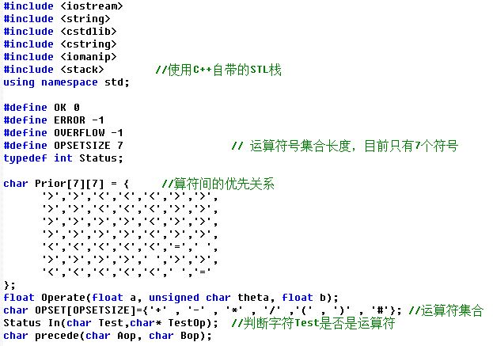
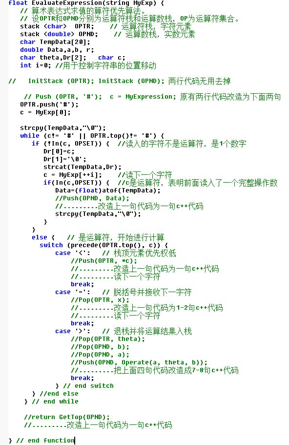
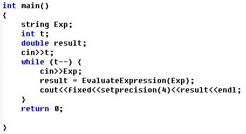

### 题目描述
计算一个表达式的运算结果

使用C++自带stack堆栈对象来实现

参考课本的算法伪代码P53-54

例如

1. Push (OPTR, '#');表示把字符#压入堆栈OPTR中，转换成c++代码就是OPTR.push('#');

2. Pop(OPND, a); 表示弹出栈OPND的栈顶元素，并把栈顶元素放入变量a中。因此改成c++代码是两个操作：

a = OPND.top();   OPND.pop();

3. a = GetTop(OPND)表示获取栈OPND的栈顶元素，转成c++代码就是： a = OPND.top();




### 输入
第一个输入t，表示有t个实例

第二行起，每行输入一个表达式，每个表达式末尾带#表示结束

输入t行
### 输出
每行输出一个表达式的计算结果，计算结果用浮点数（含4位小数）的格式表示

用cout控制浮点数输出的小数位数，需要增加一个库文件，并使用fixed和setprecision函数，代码如下：
```cpp
#include <iostream>
#include<iomanip>
using namespace std;

int main(){ 
    double temp = 12.34
    cout<<fixed<<setprecision(4)<<temp<<endl;
}
```
输出结果为12.3400
### 输入样例1
```cpp
2
1+2*3-4/5#
(66+(((11+22)*2-33)/3+6)*2)-45.6789#
```

### 输出样例1
```cpp
6.2000
54.3211
```
### 源代码
```cpp
#include <iostream>
#include <string>
#include <stack>
#include <cstring>
#include <iomanip>


using namespace std;

#define OK 0
#define ERROR -1
#define OPSETSIZE 7
typedef int Status;

char Prior[7][7] = {'>', '>', '<', '<', '<', '>', '>', '>', '>', '<', '<', '<', '>', '>', '>', '>', '>', '>', '<', '>',
                    '>', '>', '>', '>', '>', '<', '>', '>', '<', '<', '<', '<', '<', '=', ' ', '>', '>', '>', '>', ' ',
                    '>', '>', '<', '<', '<', '<', '<', ' ', '='};

float Operate(float a, unsigned char theta, float b) {
    if (theta == '+') return a + b;
    if (theta == '-') return a - b;
    if (theta == '*') return a * b;
    if (theta == '/') return a / b;

    return ERROR;
}

char OPSET[OPSETSIZE] = {'+', '-', '*', '/', '(', ')', '#'};

Status In(char Test, const char *TestOp) {
    for (int i = 0; i < 7; i++)
        if (Test == TestOp[i]) return 1;
    return OK;
}

char precede(char Aop, char Bop) {
    int r1, r2;
    if (Aop == '+') r1 = 0;
    if (Aop == '-') r1 = 1;
    if (Aop == '*') r1 = 2;
    if (Aop == '/') r1 = 3;
    if (Aop == '(') r1 = 4;
    if (Aop == ')') r1 = 5;
    if (Aop == '#') r1 = 6;

    if (Bop == '+') r2 = 0;
    if (Bop == '-') r2 = 1;
    if (Bop == '*') r2 = 2;
    if (Bop == '/') r2 = 3;
    if (Bop == '(') r2 = 4;
    if (Bop == ')') r2 = 5;
    if (Bop == '#') r2 = 6;
    return Prior[r1][r2];
}

float EvaluateExpression(string MyExp) {
    stack<char> OPTR;   //运算符栈
    stack<double> OPND; //操作数栈
    char TempData[20];
    double Data, a, b;
    char theta, Dr[2];  //theta是符号， Dr[2]记录数据（因为比如52+2*3，52是一个数，所以Dr记录一位5，并给TempData）
    char c; //字符串中每个字符的记录者
    int i = 0;  //字符在字符串的位置
    OPTR.push('#');
    c = MyExp[0];

    strcpy(TempData, "\0"); //初始化TempData为“0”
    while (c != '#' || OPTR.top() != '#') {
        if (!In(c, OPSET)) {
            //把数记录到Tempdata
            Dr[0] = c;
            Dr[1] = '\0';
            strcat(TempData, Dr);
            c = MyExp[++i];
            if (In(c, OPSET)) { //如果字符下一位是运算符，那么就直接转换字符串为浮点数，并入操作数栈内
                Data = (float) stof(TempData);
                OPND.push(Data);
                strcpy(TempData, "\0"); //初始化
            }
        } else {
            switch (precede(OPTR.top(), c)) {
                case '<':
                    OPTR.push(c);
                    c = MyExp[++i];
                    break;
                case '=':
                    OPTR.pop();
                    c = MyExp[++i];
                    break;
                case '>':
                    theta = OPTR.top();
                    OPTR.pop();
                    b = (float) OPND.top();
                    OPND.pop();
                    a = (float) OPND.top();
                    OPND.pop();
                    OPND.push(Operate(a, theta, b));
                    break;
            }
        }
    }
    return OPND.top();
}

int main() {
    int t;
    cin >> t;
    while (t--) {
        string str;
        cin >> str;
        float res = EvaluateExpression(str);
        cout << fixed << setprecision(4) << res << endl;
    }
}
```